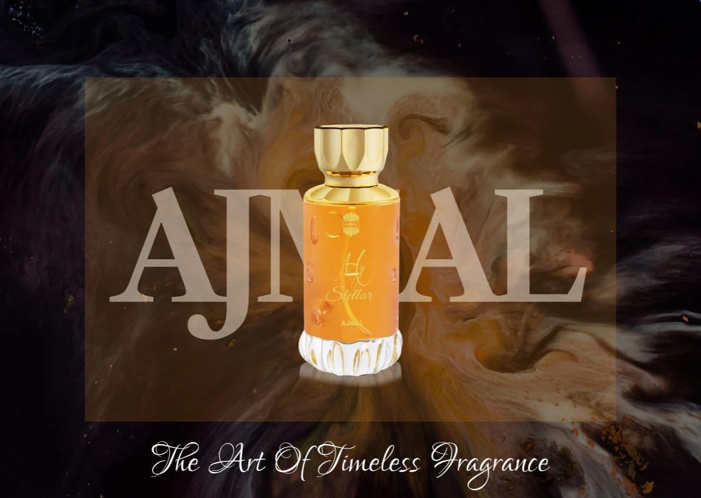

# Ajmal My Stellar – Luxury Perfume Landing Page

An interactive luxury fragrance landing page concept designed in Figma.

## Overview

Ajmal My Stellar is a premium perfume landing page that combines elegant visual design, product storytelling, and interactive animations to create an immersive user experience.

## Prototype Demo

## Features

* Luxury black-and-gold aesthetic
* Interactive product showcase
* Smart Animate transitions
* Premium fragrance storytelling
* Responsive web layout concept
* Prototype navigation between sections

## Design Goals

* Create a modern luxury brand experience
* Highlight fragrance features and notes
* Improve visual engagement through animations
* Showcase UI/UX design and prototyping skills

## Tools Used

* Figma
* Smart Animate
* Auto Layout
* Prototyping

### Interactive Prototype

Figma Prototype:
[[FIGMA PROTOTYPE LINK](https://www.figma.com/proto/DYhK2TfOYYLNYONaBwIxFa/Ajmal?node-id=4-6&t=pocYl4ptRF96cCca-1)]

Behance Project:
[[BEHANCE LINK](https://www.behance.net/gallery/251037189/Ajmal-My-Stellar-Luxury-Perfume-UIUX-Design)]

## Designer

**Aditi Biswas**

UI/UX Designer
